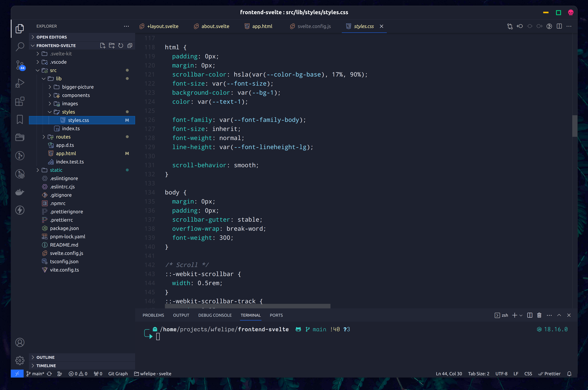

# PLANE-VSCODE THEME

A beautiful theme for Visual Code, more information in [Plane project](https://github.com/wfpaisa/plane)

 

## Install
1. Download in `~/.vscode/extensions/plane`
2. Open: Visual Studio Code -> Settings -> Color Theme  choose Plane

## Build
- `npm i`
- `npm run attach`
- `npm run build`

## License

[MIT License](./LICENSE)
