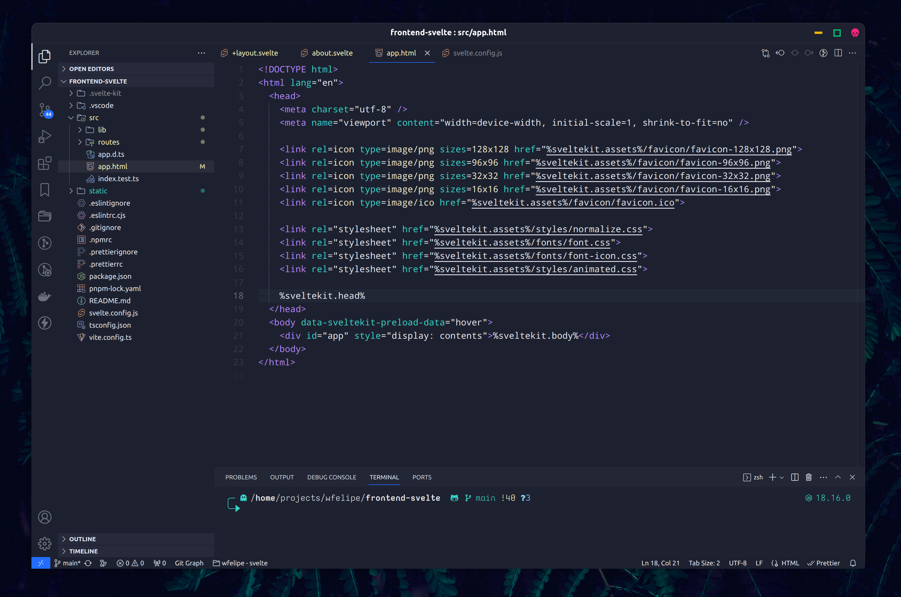

# PLANE THEME

A beautiful theme for Visual Code, more information in [Plane project](https://github.com/wfpaisa/plane)

## Install

`ext install Planetheme.plane-theme`

https://marketplace.visualstudio.com/items?itemName=Planetheme.plane-theme

## Debug

[Docs](https://code.visualstudio.com/api/language-extensions/syntax-highlight-guide).
[Publish](https://code.visualstudio.com/api/working-with-extensions/publishing-extension)

run `ctrl + f5` for debuggin;
ctrl + shift + p lock for `developer: inspect tokens and scopes`

## License

[MIT License](./LICENSE)
